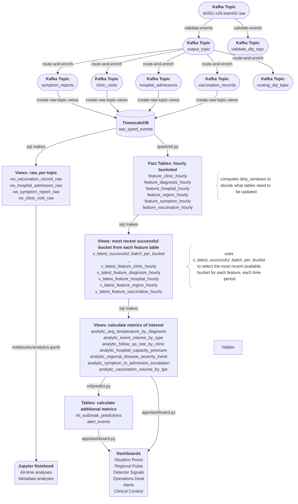

```mermaid

flowchart TD
    A(["`**Kafka Topic**
    ds551-s26.team02.raw`"])  
    A -->|validate-events| B0(["`**Kafka Topic**
    output_topic`"])
    A -->|validate-events| B1(["`**Kafka Topic**
    validate_dlq_topc`"])
    B0 -->|route-and-enrich| C0(["`**Kafka Topic**
    symptom_reports`"])
    B0 -->|route-and-enrich| C1(["`**Kafka Topic**
    clinic_visits`"])
    B0 -->|route-and-enrich| C2(["`**Kafka Topic**
    hospital_admissions`"])
    B0 -->|route-and-enrich| C3(["`**Kafka Topic**
    vaccination_records`"])
    B0 -->|route-and-enrich| C4(["`**Kafka Topic**
    routing_dql_topic`"])
    C0 -->|create-raw-topic-views| D1[("`**TimescaleDB**
    raw_typed_events`")]
    C1 -->|create-raw-topic-views| D1
    C2 -->|create-raw-topic-views| D1
    C3-->|create-raw-topic-views| D1

    D1 -->|sql makes| E["`**Views: raw, per-topic**
    vw_vaccination_record_raw
    vw_hospital_admission_raw
    vw_symptom_report_raw
	vw_clinic_visit_raw`"]
    
    D1 -->|"spark/etl.py"| F1["`**Fact Tables: hourly bucketed**
    feature_clinic_hourly
    feature_diagnosis_hourly
    feature_hospital_hourly
    feature_region_hourly
    feature_symptom_hourly
    feature_vaccination_hourly`"]
    D1 ~~~ F2@{ shape: brace-l, label: "computes dirty_windows to decide what tables need to be updated" }


    F1 -->|sql makes| G1["`**Views: most recent successful bucket from each feature table**
    _v_latest_successful_batch_per_bucket_
    _
    v_latest_feature_clinic_hourly
    v_latest_feature_diagnosis_hourly
    v_latest_feature_hospital_hourly
    v_latest_feature_region_hourly
    v_latest_feature_vaccination_hourly`"]
    F1 ~~~ G2@{ shape: brace-l, label: "uses _v_latest_successful_batch_per_bucket_ to select the most recent available bucket for each feature, each time period" }
    G2 ~~~ hidden:::hidden

    G1 -->|sql makes| H1["`**Views: calculate metrics of interest**
    analytic_avg_temperature_by_diagnosis
	analytic_event_volume_by_type
	analytic_follow_up_rate_by_clinic
	analytic_hospital_capacity_pressure
    analytic_regional_disease_severity_trend
    analytic_symptom_to_admission_escalation
	analytic_vaccination_volume_by_tpe`"]

    H1 -->|ml/predict.py| x["`**Tables: calculate additional metrics**
    ml_outbreak_predictions
    alert_events`"]

    x -->|app/dashboard.py| I1

    H1 -->|app/dashboard.py| I1@{ shape: notch-rect, label: "**Dashboards**
    Situation Room
    Regional Pulse
    Detector Signals
    Operations Desk
    Alerts
    Clinical Context" }

    E ----->|notebooks/analytics.ipynb| I2@{ shape: notch-rect, label: "**Jupyter Notebook**
    All-time analyses
    Metadata analyses" }
   
   
```